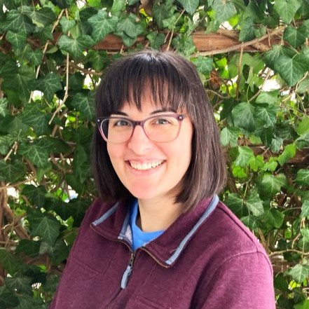

# Data Scientist

### Summary
Currently earning a MS degree in Data Science with over ten years professional laboratory experience in healthcare cytogenetics and recent web development and data analysis certificates and projects. Lifelong learner who excels at attention to detail, time management, and teamwork. Leveraging organization and prioritization transferable skills from a genetics background to career pivot into Data Science.  

### Projects
Relationship Between Crime and Unemployment | [Report](https://emilyk221.github.io/crime-unemployment-relationship/)
  - Using EDA and RStudio, combined data from multiple public sources and reported on insights gathered
  - Designed plots to visualize numerical data and variable relationships, presented findings in video format

Natural Language Processing | [GitHub Repo](https://github.com/emilyk221/natural-language-processing-program)
  - Analyzed presidential debate transcript text using Python, Pandas, and TextBlob in Jupyter notebook

Classification Web App | [Web App](https://classification-web-app-fwnaxvgw3ufrpeewu6umcp.streamlit.app/)
  - Built a binary classification web app using Python and Streamlit, code on GitHub and deployed on Streamlit
  - Designed app to give metrics data comparing accuracy and precision for different classification models

Capstone Data Insights Project | [Data Insights Presentation](https://docs.google.com/presentation/d/132pwonusVjFsx0GOPRNQvSTYR9tOq0bU2ZYpplRF9BA/edit?usp=sharing)
  - Explored data using Google Sheets and statistical measures, applied and interpreted a linear regression model

### Education
- MS in Data Science | Ball State University (expected graduation Dec. 2026)
- Certificate in Data Analysis | Meta, Coursera
- Certificate in Full Stack Web Development | The Ohio State University
- BS in Cytogenetics | University of Texas Health Science Center in San Antonio
- BS in Genetics & Psychology | Texas A&M University

### Professional Experience
Balanced Family Academy - Clintonville	Columbus, OH | Teacher	Oct 2021 - Present
  - Facilitated scheduled classroom learning activities for children ages 0-5, modeled and taught social skills daily
  - Responsible for parent communication, monitoring classroom environment for safety, and training new hires
  - Received “Impact Player of the Month” for reliability and positive attitude

Ohio State University Wexner Medical Center	Columbus, OH | Cytogenetics Lab Technologist	Jul 2011 - Jul 2021
  - Performed cell culturing, cell-cycle manipulation, DNA-tagging, and fluorescent and brightfield microscopy
  - Analyzed chromosome banding patterns, routinely exceeding the average productivity by 15%
  - Collaboratively improved workflow efficiency, written procedures, and a new hire training plan
  - Solved daily wet lab quality issues, communicated stat results, and tracked reagent inventory using MS Excel

